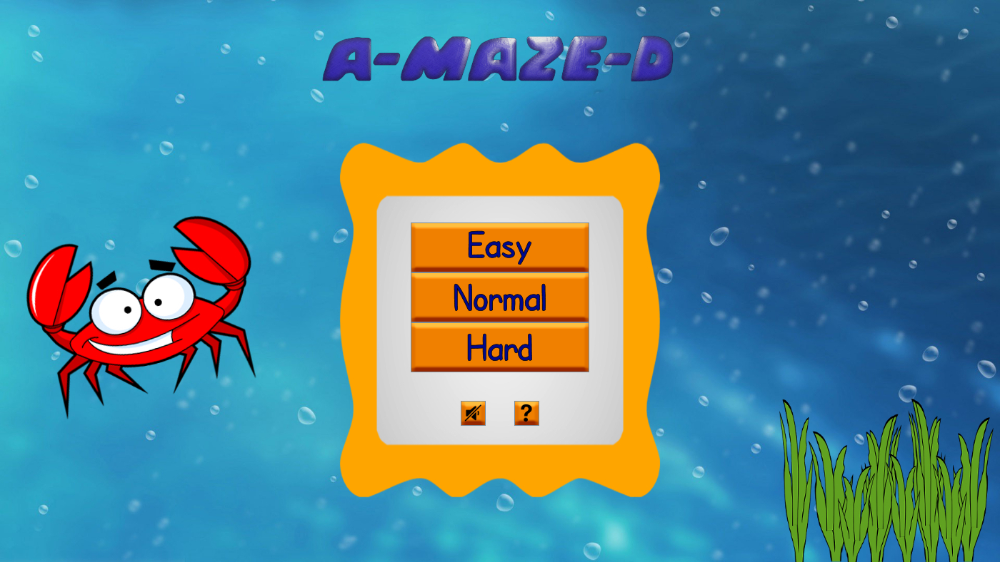
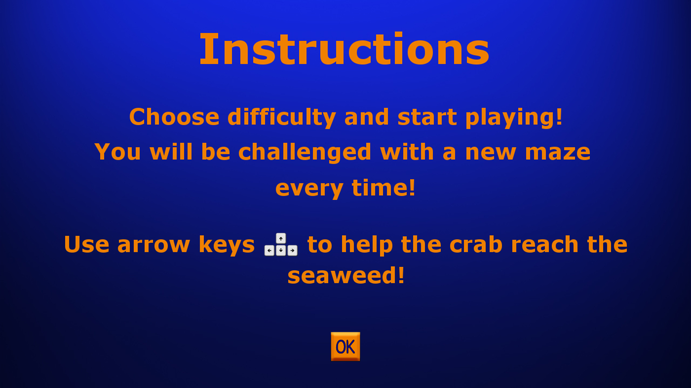
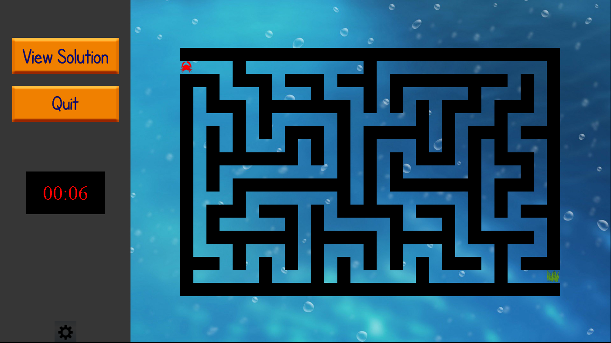
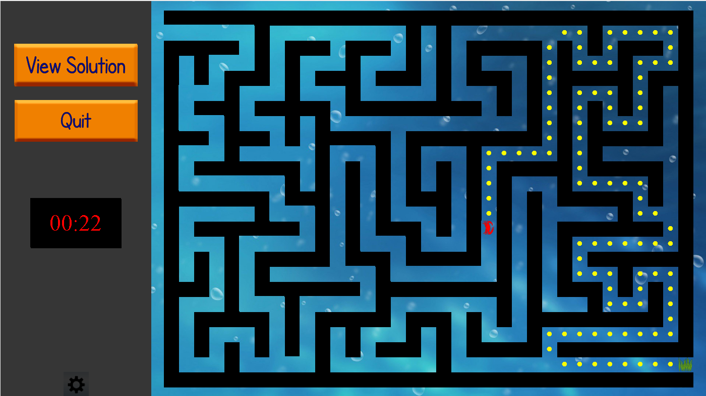

# A-MAZE-D
A simple maze game with swing UI that I created while learning Java just for fun. 
It generates simple mazes and can find the solution with backtracking using my implemented data structures. 
The custom data structures (linked list and stack) as well as the backtracking algorithm are part of my 3rd semester Data Structures course project.

### Usage:
Just run A_MAZE_D.java

### Here are some screenshots:

Main screen: \

Help screen: \

Maze example: \

Halfway solution example: \

